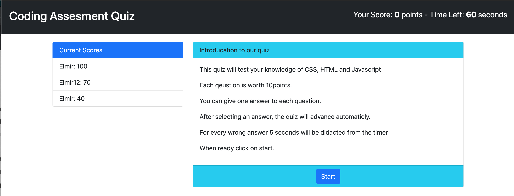

Coding Assessment Quiz Application

Simple application to display a HTML,CSS and JavaScript Knowledge Quiz.
This application also keeps the score of those that took the quiz in a desc order.

This application utilizes:
- dataset to store the questions
- dataset to store the answers
- setinterval to handle the counter
- jQuery closest, show, hide, delay and fadeout function to naviagte questions

Using JSON to:
- to format score data and localstorage to store the formated data.
- JSON.parse to parse the stored data

Using CSS: 
- to format and hide HTML divs

The following image demonstrates the web application's appearance:

To view the working app use the link below:

https://elmir123.github.io/code-quiz/